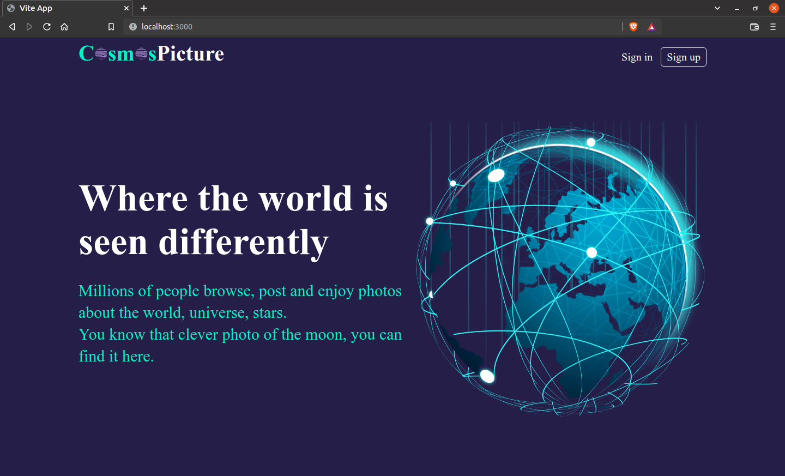
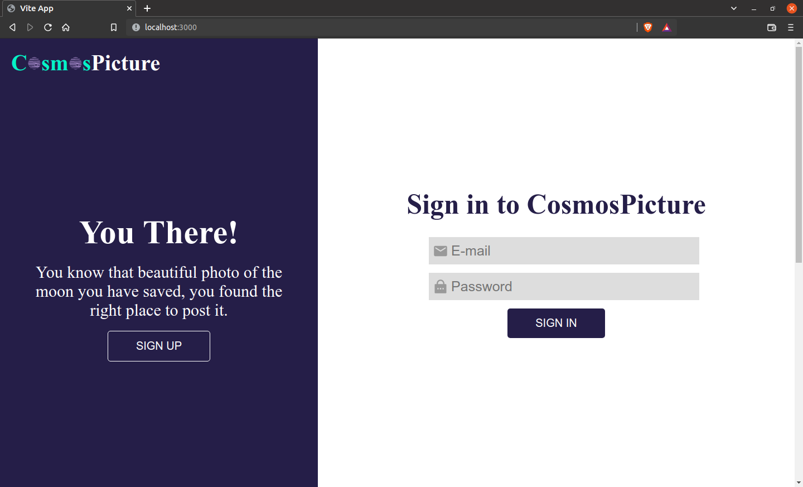
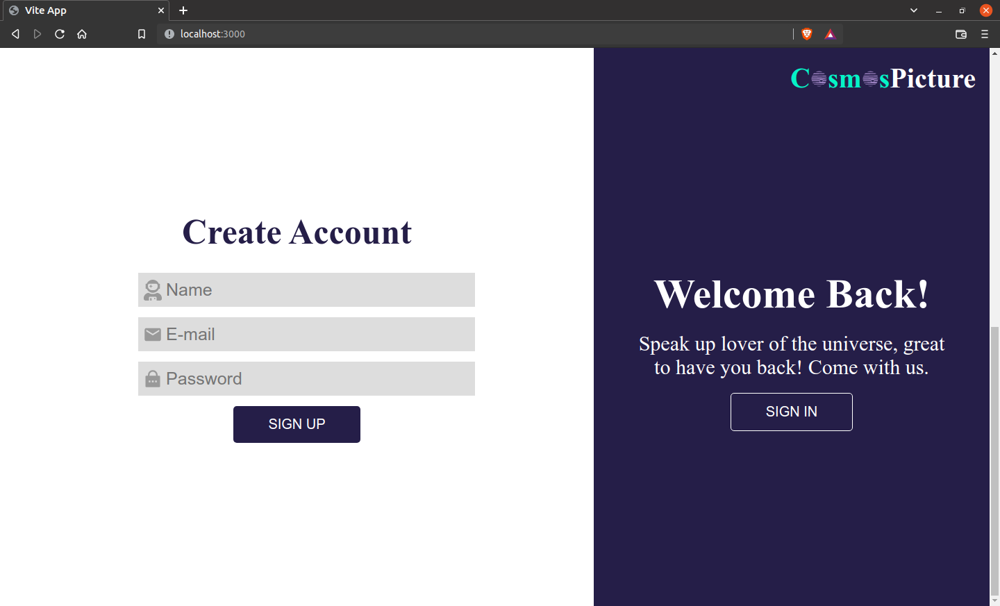

# Cosmos Picture 🌍​​

## 👀 Como ficou ???

</img>
----------
</img>
----------
</img>
----------

## 🧑‍💻 Tecnologias usadas

O projeto foi desenvolvido com as seguintes tecnologias:
- [TypeScript](https://www.typescriptlang.org/)
- [React JS](https://pt-br.reactjs.org/)
- [Styled-components](https://styled-components.com/)

## ⌨️ Sobre o projeto

O projeto consiste na parte frontend de um sistema de login, contendo a página sign in, sign up e home. Ele foi criado utilizando [Vite](https://vitejs.dev/).

## Rodar o projeto

Primeiramente é necessário ter o node, caso não tenha faça a instalação dele. [NODE](https://nodejs.org/en/download/) 

## `npm install`

É necessário dar um "npm install" ou "npm i", para instalar as depêndencias do projeto.

## `npm run dev`

Depois de ter instalado as dependências, basta dar um "npm run dev", para rodar o projeto em modo desenvolvedor. Abra [http://localhost:3000](http://localhost:3000) para vê o projeto em seu navegador.